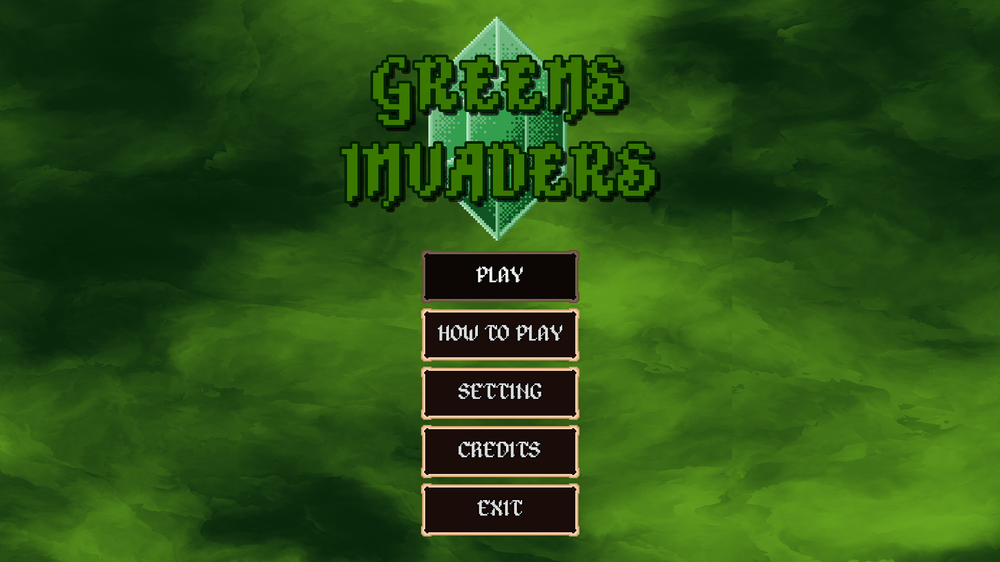

## Ciao, sono KioFatto

**Game designer e game developer.** Progetto, disegno e costruisco videogiochi:
concept, pixel art in Aseprite, gameplay in GDScript e shader su Godot Engine.
Aperto a collaborazioni e a nuove idee.

 

## Il progetto: Greens Invaders

**Roguelite fantasy arcade ispirato a Space Invaders**, in sviluppo con Godot per Steam.

- Pixel art originale fatta a mano in Aseprite
- Circa 10 spell, negozio e reroll
- 4 aree nella 1.0: Torri, Caverne, Villaggi, Caverne Profonda
- Lingue: EN/IT
- Demo giocabile subito sul browser

Steam Next Fest 2027, lancio previsto sulla seconda meta del 2027.

 

## Tech stack

 

## Altri giochi (game jam & esperimenti)

 

## Stats

 

## Attivita'

<picture>
  <source media="(prefers-color-scheme: dark)" srcset="https://raw.githubusercontent.com/KioFatto/KioFatto/output/github-contribution-grid-snake-dark.svg">
  <source media="(prefers-color-scheme: light)" srcset="https://raw.githubusercontent.com/KioFatto/KioFatto/output/github-contribution-grid-snake.svg">
  
</picture>

 

## Contatti

